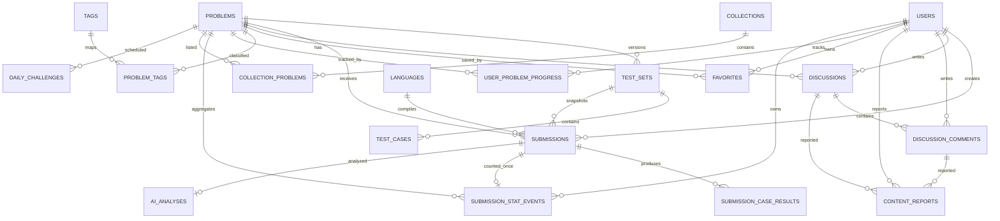

# 数据模型

## ER 模型

## 关键约束

- 用户名与邮箱使用 `citext`，实现大小写不敏感唯一性。
- 隐藏测试数据只存 MinIO object key 和 checksum，不在 PostgreSQL 保存明文。
- 新提交只在 MinIO 保存源码正文，`submissions` 保存内部 object key 和 checksum；所有公开 DTO 都隐藏这两个内部字段。
- `submission_case_results` 不向普通用户暴露隐藏用例输入输出。
- 收藏、题目进度、题单映射都使用联合唯一约束，所有消费端可以安全重试。
- 用户统计字段是读优化缓存，正式值可从提交和进度表重建。
- `(problem_id) WHERE status='active'` 部分唯一索引保证每题最多一个 active 测试集；`(test_set_id, sequence)` 保证版本内序号唯一。
- 正式 Submission 通过复合外键绑定同一道题的 TestSet，并快照题面版本与资源限制。

## 测试集版本与 Submission 快照

`20260812_0009` 新增 `test_sets`，把 `test_cases.problem_id` 替换为 `test_set_id`，并为正式提交增加快照：

| ORM | 表 | 关键约束 |
| --- | --- | --- |
| `TestSet` | `test_sets` | `(problem_id, version)` 唯一；每题 active 部分唯一；checker 配置 CHECK；聚合用例数/总分 |
| `TestCase` | `test_cases` | `(test_set_id, sequence)` 唯一；数据库仅保存 object key、组合 checksum、验证后大小和分值 |
| `Submission` | `submissions` | `test_set_id + problem_id` 复合外键；正式/样例模式 CHECK；版本、时间和内存快照不可变 |

数据库触发器拒绝修改或删除已被 Submission 引用的测试集/用例，并拒绝修改 Submission 判题快照。测试用例写入后触发器维护 `case_count` 与 `total_score`；ready/active 必须至少一个用例且总分为 100。服务状态流转为 `draft/invalid -> validating -> ready|invalid -> active -> inactive`；只有未引用 draft 可物理删除。

迁移将历史隐藏用例归档为 v1；满足正分且总分 100 时激活，否则保持 inactive 并把对应 public 题目降为 draft。历史非隐藏/样例记录为保留外键进入单独 inactive v2，Judge 不读取它。历史正式提交快照到 v1，样例提交保持 `test_set_id=NULL`；历史未发布 Outbox payload 被收紧为 `event_id + submission_id`。

## Sprint 2 题库 ORM

`app/models/problem.py` 使用 SQLAlchemy 2.0 typed declarative mapping，并继续以 PostgreSQL DDL 为生产结构权威来源：

| ORM | 表 | 关键关系/约束 |
| --- | --- | --- |
| `Problem` | `problems` | `slug` 唯一；结构层级、训练分类和可见性使用命名 ENUM；一对多关联 `ProblemTag`、`UserProblemProgress` |
| `Tag` | `tags` | `slug`、`name` 分别唯一 |
| `ProblemTag` | `problem_tags` | `(problem_id, tag_id)` 联合主键，级联删除 |
| `Language` | `languages` | `slug` 唯一；内部保存运行配置，公开 DTO 只输出编辑器元数据 |
| `UserProblemProgress` | `user_problem_progress` | `(user_id, problem_id)` 联合主键，记录尝试次数与首次通过时间 |
| `Favorite` | `favorites` | `(user_id, problem_id)` 联合主键；按用户收藏时间和题目建索引 |

`last_submission_id` 的 PostgreSQL 外键由迁移维护。异步查询统一预加载标签关联，避免响应序列化期间触发隐式数据库 IO。

## 题库查询与索引

- 所有普通查询强制附加 `problems.visibility = 'public'`。
- 标签筛选通过 `problem_tags` 的存在性子查询完成，避免连接导致分页重复。
- 登录用户按 `(user_id, problem_id)` 左连接个人进度；`attempted` 筛选定义为尝试次数大于 0 且尚未通过。
- 总数与当前页分别查询，排序始终追加稳定的 `id` 次序。
- `20260808_0003` 增加部分索引 `idx_problems_public_created (created_at DESC, id DESC) WHERE visibility = 'public'`，服务默认最新排序。
- `20260813_0013` 增加 `training_category` ENUM 和公开分类索引。`difficulty` 保留兼容值 `easy/medium/hard`，用户语义改为输入输出结构的“基础/组合/综合”。同一迁移保留原 JavaScript 语言外键并将其升级为 `nodejs`，新增 `javascript-v8`，停用其他用户提交语言。

## 数据边界

公开 API 和管理员题目 API 都不直接序列化 ORM，而使用 Pydantic 白名单 DTO：

- `LanguagePublic` 不包含 `compile_command`、`run_command`、`docker_image`。
- 题目 DTO 不关联 `test_cases`，不会输出隐藏输入输出或 MinIO object key。
- 种子格式只接受题面、限制、可见性和标签，不接受测试用例及沙箱运行配置。

数据库结构由 `backend-api/migrations/versions/` 中的 Alembic 版本迁移维护。初始迁移显式保留 PostgreSQL 的 CITEXT、命名 ENUM、部分索引和 `set_updated_at` 触发器；不再使用只在首次创建数据卷时执行的一次性初始化 SQL。

## 提交与 Outbox ORM

`20260808_0004` 将初始 DDL 中已有的 `submissions`、`submission_case_results` 纳入 SQLAlchemy 2.0 async ORM，并新增可靠发布所需结构；`20260809_0005` 增加 `submission_mode` ENUM、公开样例 stdout 字段和模式索引：

| ORM | 表 | 关键约束 |
| --- | --- | --- |
| `Submission` | `submissions` | UUID 主键；用户/题目/语言外键；命名 `submission_status` / `submission_mode` ENUM；源码 checksum 和内部 object key |
| `SubmissionCaseResult` | `submission_case_results` | 提交与隐藏测试用例唯一组合；公开 API 不序列化输出摘录 |
| `Outbox` | `outbox_events` | 稳定事件 UUID、JSONB payload、重试时间、发布时间与 stream message id |

`(user_id, idempotency_key)` 使用 `idempotency_key IS NOT NULL` 部分唯一索引，既允许未提供幂等键的提交，也能在并发请求下保证单写。`idx_outbox_unpublished_retry` 只覆盖未发布事件，用于 publisher 的重试扫描。

`trg_submissions_status_transition` 在数据库层拒绝跳跃、回退和终态重入；应用服务层提供相同规则，便于在写库前返回明确错误。该触发器与已有 `trg_submissions_updated_at` 同时保留。

`mode=sample` 的终态只保存公开样例的聚合结果和截断 stdout，不写 `submission_case_results`，也不更新 `user_problem_progress`、用户统计或题目统计；`mode=judge` 才会写正式进度与统计。两种模式都不在公开响应中返回隐藏测试数据。

## 训练统计与重建

`20260809_0006` 新增 `submission_stat_events`。该表以 `submission_id` 为主键，并保存用户、题目、终态、是否 Accepted 和应用时间；约束拒绝非终态。Judge 的终态条件更新、用例结果、台账插入、进度 upsert、用户计数和题目计数处于同一事务。重复消息无法再次插入台账，不会重复计数；同一道题后续 Accepted 只增加 Accepted 次数，不再增加 solved 数。

`python -m app.maintenance.rebuild_statistics --apply` 从 `mode=judge` 的终态提交重建全部派生状态。在线终态事务使用共享 advisory lock，重建使用同名独占锁，因此不会与实时 Judge 写入交错。命令必须连接正确数据库并显式提供 `--apply`，生产执行前仍需备份并核对目标环境。

## 内容运营与审核

`20260810_0007` 将已有题单、每日一题和讨论表纳入可维护的 SQLAlchemy 2.0 async 模型，并增加审核结构：

| ORM | 表 | 关键约束 |
| --- | --- | --- |
| `Collection` | `collections` | `slug` 唯一，创建人可空；公开列表使用部分索引 |
| `CollectionProblem` | `collection_problems` | `(collection_id, problem_id)` 唯一，`(collection_id, sequence)` 唯一并定义稳定顺序 |
| `DailyChallenge` | `daily_challenges` | 业务日期主键；同一天仅一个题目 |
| `Discussion` | `discussions` | 作者删除后保留内容并显示注销用户；保存锁定、置顶、审核、举报聚合和软删除状态 |
| `DiscussionComment` | `discussion_comments` | `parent_id` 自关联；`depth BETWEEN 0 AND 3`；作者删除后保留评论 |
| `ContentReport` | `content_reports` | 讨论/评论目标严格二选一；按用户和目标的部分唯一索引保证并发幂等举报 |
| `ContentModerationAction` | `content_moderation_actions` | 记录管理员、目标、动作、原因和时间，不从业务表反推审计历史 |

公开查询只返回已发布题单、公开题目和审核通过且未软删除的内容。作者能看到自己的待审内容，管理员能在审核接口中访问全部状态。举报聚合计数使用条件插入后的原子增量，不依赖先读后写；评论计数仅统计公开可见评论，并在审核状态变化时原子调整。遗留 `like_count` 暂无写接口；启用点赞前必须增加用户—内容关系表，以关系唯一约束作为计数幂等来源。

## AI 分析、成本与审计

`20260811_0008` 扩展已有 `ai_analyses`，增加冗余所有权、输入 fingerprint、结构化引导问题、缓存来源、重试、延迟、成本与安全错误字段；同时新增：

| ORM | 表 | 关键约束 |
| --- | --- | --- |
| `AIAnalysis` | `ai_analyses` | 每个 submission 唯一；user 外键；状态使用既有 PostgreSQL ENUM；已完成 fingerprint 与待处理任务使用部分索引 |
| `AIUsageRecord` | `ai_usage_records` | analysis 唯一，幂等记录 token、微美元成本与缓存命中 |
| `AuditLog` | `audit_logs` | actor 可空，目标使用稳定字符串，metadata 仅接受业务白名单字段 |

数据库不保存完整 Prompt。公开 DTO 不包含 provider request id、token、成本、fingerprint、MinIO object key 或内部错误。AI Worker 的 SQL 没有更新 `submissions.status` 的权限路径，正式 Judge 状态仍是唯一权威结果。
