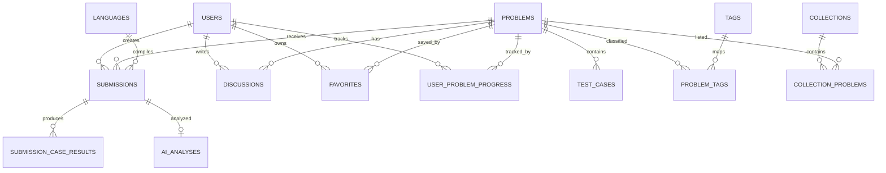

# 数据模型

## ER 模型

## 关键约束

- 用户名与邮箱使用 `citext`，实现大小写不敏感唯一性。
- 隐藏测试数据只存 MinIO object key 和 checksum，不在 PostgreSQL 保存明文。
- 新提交只在 MinIO 保存源码正文，`submissions` 保存内部 object key 和 checksum；所有公开 DTO 都隐藏这两个内部字段。
- `submission_case_results` 不向普通用户暴露隐藏用例输入输出。
- 收藏、题目进度、题单映射都使用联合唯一约束，所有消费端可以安全重试。
- 用户统计字段是读优化缓存，正式值可从提交和进度表重建。

## Sprint 2 题库 ORM

`app/models/problem.py` 使用 SQLAlchemy 2.0 typed declarative mapping，并继续以 PostgreSQL DDL 为生产结构权威来源：

| ORM | 表 | 关键关系/约束 |
| --- | --- | --- |
| `Problem` | `problems` | `slug` 唯一；难度和可见性使用命名 ENUM；一对多关联 `ProblemTag`、`UserProblemProgress` |
| `Tag` | `tags` | `slug`、`name` 分别唯一 |
| `ProblemTag` | `problem_tags` | `(problem_id, tag_id)` 联合主键，级联删除 |
| `Language` | `languages` | `slug` 唯一；内部保存运行配置，公开 DTO 只输出编辑器元数据 |
| `UserProblemProgress` | `user_problem_progress` | `(user_id, problem_id)` 联合主键，记录尝试次数与首次通过时间 |

`last_submission_id` 的 PostgreSQL 外键由迁移维护。异步查询统一预加载标签关联，避免响应序列化期间触发隐式数据库 IO。

## 题库查询与索引

- 所有普通查询强制附加 `problems.visibility = 'public'`。
- 标签筛选通过 `problem_tags` 的存在性子查询完成，避免连接导致分页重复。
- 登录用户按 `(user_id, problem_id)` 左连接个人进度；`attempted` 筛选定义为尝试次数大于 0 且尚未通过。
- 总数与当前页分别查询，排序始终追加稳定的 `id` 次序。
- `20260808_0003` 增加部分索引 `idx_problems_public_created (created_at DESC, id DESC) WHERE visibility = 'public'`，服务默认最新排序。

## 数据边界

公开 API 和管理员题目 API 都不直接序列化 ORM，而使用 Pydantic 白名单 DTO：

- `LanguagePublic` 不包含 `compile_command`、`run_command`、`docker_image`。
- 题目 DTO 不关联 `test_cases`，不会输出隐藏输入输出或 MinIO object key。
- 种子格式只接受题面、限制、可见性和标签，不接受测试用例及沙箱运行配置。

数据库结构由 `backend-api/migrations/versions/` 中的 Alembic 版本迁移维护。初始迁移显式保留 PostgreSQL 的 CITEXT、命名 ENUM、部分索引和 `set_updated_at` 触发器；不再使用只在首次创建数据卷时执行的一次性初始化 SQL。

## 提交与 Outbox ORM

`20260808_0004` 将初始 DDL 中已有的 `submissions`、`submission_case_results` 纳入 SQLAlchemy 2.0 async ORM，并新增可靠发布所需结构；`20260809_0005` 增加 `submission_mode` ENUM、公开样例 stdout 字段和模式索引：

| ORM | 表 | 关键约束 |
| --- | --- | --- |
| `Submission` | `submissions` | UUID 主键；用户/题目/语言外键；命名 `submission_status` / `submission_mode` ENUM；源码 checksum 和内部 object key |
| `SubmissionCaseResult` | `submission_case_results` | 提交与隐藏测试用例唯一组合；公开 API 不序列化输出摘录 |
| `Outbox` | `outbox_events` | 稳定事件 UUID、JSONB payload、重试时间、发布时间与 stream message id |

`(user_id, idempotency_key)` 使用 `idempotency_key IS NOT NULL` 部分唯一索引，既允许未提供幂等键的提交，也能在并发请求下保证单写。`idx_outbox_unpublished_retry` 只覆盖未发布事件，用于 publisher 的重试扫描。

`trg_submissions_status_transition` 在数据库层拒绝跳跃、回退和终态重入；应用服务层提供相同规则，便于在写库前返回明确错误。该触发器与已有 `trg_submissions_updated_at` 同时保留。

`mode=sample` 的终态只保存公开样例的聚合结果和截断 stdout，不写 `submission_case_results`，也不更新 `user_problem_progress`、用户统计或题目统计；`mode=judge` 才会写正式进度与统计。两种模式都不在公开响应中返回隐藏测试数据。
