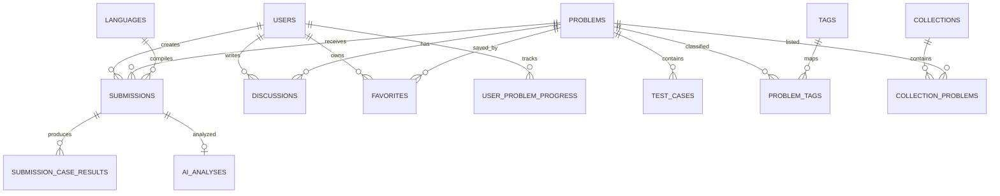

# 数据模型

## ER 模型

## 关键约束

- 用户名与邮箱使用 `citext`，实现大小写不敏感唯一性。
- 隐藏测试数据只存 MinIO object key 和 checksum，不在 PostgreSQL 保存明文。
- `submissions.source_code` 仅用于 MVP/短代码快速查询；接入 MinIO 后以 `source_object_key` 为权威副本，并可按保留策略清理明文。
- `submission_case_results` 不向普通用户暴露隐藏用例输入输出。
- 收藏、题目进度、题单映射都使用联合唯一约束，所有消费端可以安全重试。
- 用户统计字段是读优化缓存，正式值可从提交和进度表重建。

完整 DDL 位于 `infra/postgres/init/001_schema.sql`。

